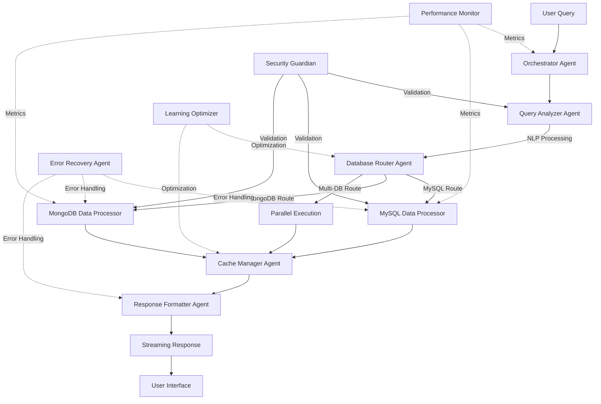
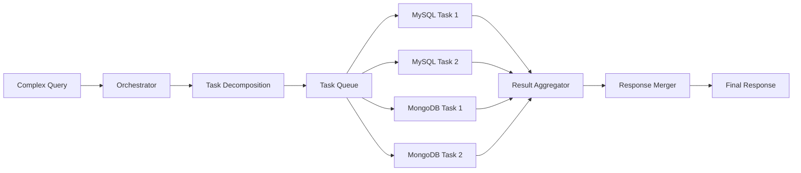
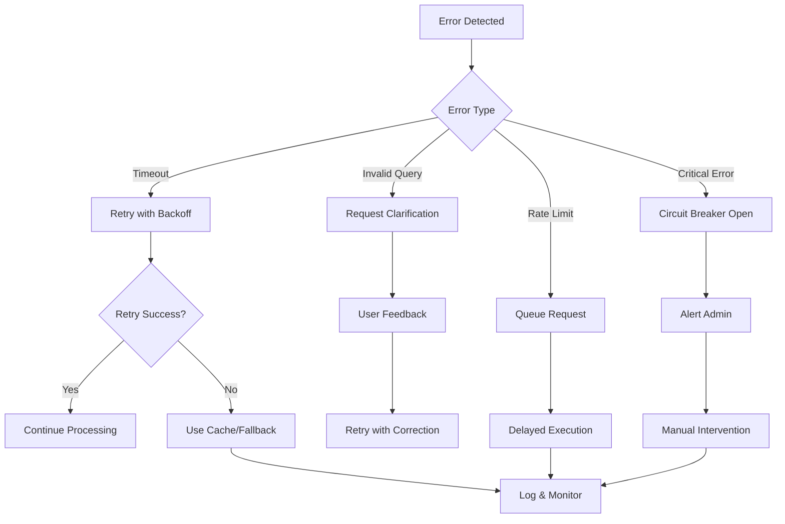
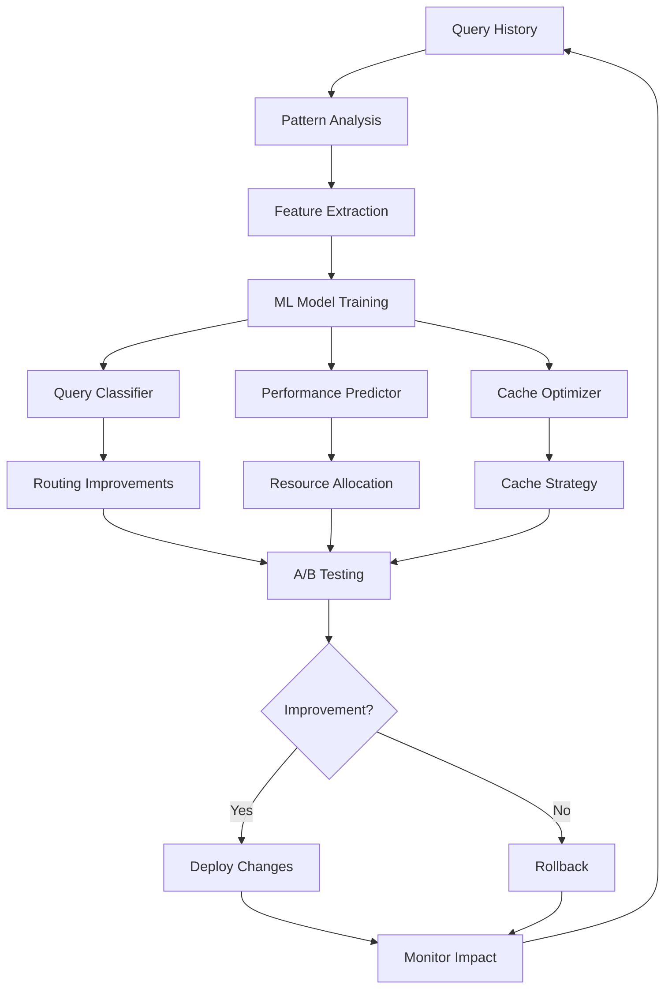

# Sistema Multi-Agente TrendsPro - Arquitectura de Agentes Inteligentes

## 1. Arquitectura de Agentes

### 1.1 Agentes Core

#### **Orchestrator Agent** (Agente Orquestador Principal)
- **Responsabilidad**: Coordinación central de flujos de trabajo, routing inteligente de consultas, gestión de prioridades y balanceo de carga entre agentes especializados
- **Capacidades**:
  - Task decomposition para queries complejas
  - Priority queue management con algoritmo de scheduling
  - Load balancing entre agentes del mismo tipo
  - Circuit breaker para manejo de fallos
  - Retry logic con exponential backoff
- **Herramientas**:
  - Redis Queue para task management
  - Celery/RabbitMQ para distribución de tareas
  - Prometheus para métricas
  - OpenTelemetry para tracing distribuido
- **Prompts**:
```python
ORCHESTRATOR_SYSTEM_PROMPT = """
You are the Orchestrator Agent for TrendsPro, responsible for coordinating all database queries and agent interactions.

Your responsibilities:
1. Analyze incoming queries to determine optimal routing
2. Decompose complex queries into sub-tasks
3. Coordinate parallel execution when possible
4. Aggregate results from multiple agents
5. Handle errors and implement retry logic

Context:
- MySQL: Analytics, trends, sales, risk groups (Z_Y scores)
- MongoDB: Operations, pharmacies, bookings, catalog, payments
- Partners: Glovo, Uber, Danone, Hartmann, Carrefour

Decision framework:
- Route to QueryAnalyzer for NLP processing
- Route to DatabaseRouter for DB selection
- Route to appropriate DataProcessor for execution
- Route to ResponseFormatter for final output

Output format: JSON with routing decisions and task breakdown
"""

TASK_DECOMPOSITION_PROMPT = """
Given the query: {query}

Break it down into atomic tasks:
1. Identify data sources needed
2. Determine if parallel execution is possible
3. Define dependencies between tasks
4. Estimate execution time for each task
5. Set priority levels

Return as structured JSON:
{
  "tasks": [
    {
      "id": "task_id",
      "type": "query_type",
      "database": "mysql|mongodb",
      "priority": 1-5,
      "dependencies": [],
      "estimated_time_ms": 1000
    }
  ],
  "execution_plan": "parallel|sequential",
  "total_estimated_time_ms": 3000
}
"""
```

#### **Query Analyzer Agent** (Agente de Análisis de Consultas)
- **Responsabilidad**: Procesamiento de lenguaje natural, extracción de intenciones, identificación de entidades y parámetros
- **Capacidades**:
  - NLP en español con spaCy/Transformers
  - Intent classification (analytics, operations, reporting)
  - Entity extraction (dates, products, partners, metrics)
  - Ambiguity resolution
  - Context memory para consultas relacionadas
- **Herramientas**:
  - spaCy ES model para tokenización y NER
  - Sentence transformers para embeddings
  - Elasticsearch para búsqueda semántica
  - Redis para context caching
- **Prompts**:
```python
QUERY_ANALYZER_PROMPT = """
You are the Query Analyzer Agent specialized in Spanish natural language processing for TrendsPro.

Analyze the query: "{query}"

Extract:
1. Intent: [analytics|operations|reporting|comparison|aggregation]
2. Time range: Extract dates/periods (hoy, esta semana, mes pasado, Q1, etc.)
3. Entities:
   - Partners: [Glovo, Uber, Danone, Hartmann, Carrefour]
   - Metrics: [GMV, sales, bookings, stock, payments]
   - Products: Extract product names or categories
   - Locations: Pharmacies, cities, regions
4. Aggregations: sum, average, count, group by
5. Filters: active, status, risk group, Z_Y score ranges
6. Sorting: top N, order by

Handle ambiguities:
- If time range missing, ask or default to "últimos 7 días"
- If partner unclear, list options
- If metric undefined, infer from context

Output as structured JSON with confidence scores.
"""

ENTITY_EXTRACTION_PROMPT = """
Extract all business entities from: "{text}"

Entity types to identify:
- PARTNER: Glovo, Uber, Danone, etc.
- METRIC: GMV, ventas, pedidos, etc.
- TIME: dates, periods, ranges
- PRODUCT: product names, categories
- LOCATION: pharmacies, cities
- RISK_GROUP: 1, 2, 3, 4
- Z_Y_SCORE: numeric ranges

Return entities with:
- type
- value
- normalized_value
- confidence_score (0-1)
- position_in_text
"""
```

#### **Database Router Agent** (Agente de Enrutamiento de Base de Datos)
- **Responsabilidad**: Selección inteligente de base de datos basada en análisis semántico y reglas de negocio
- **Capacidades**:
  - Keyword matching con pesos ponderados
  - Semantic similarity usando embeddings
  - Historical query pattern learning
  - Multi-database query splitting
  - Join optimization across databases
- **Herramientas**:
  - FAISS para búsqueda vectorial
  - SQLAlchemy para query building
  - MongoDB aggregation framework
  - Query plan analyzer
- **Prompts**:
```python
DATABASE_ROUTER_PROMPT = """
You are the Database Router Agent for TrendsPro.

Given the analyzed query:
{analyzed_query}

Determine optimal database routing:

MySQL (trends_consolidado) keywords:
- Sales/Ventas: productos vendidos, top sellers, demanda
- Trends: tendencias, análisis temporal, predicciones
- Risk: grupo de riesgo (1-4), Z_Y score, cazador
- Aggregated stats: bookings_agrupado, historical data

MongoDB (ludafarma) keywords:
- Operations: farmacias activas, usuarios, real-time
- Bookings: reservas actuales, derivaciones, creator field
- Catalog: productos, EANs, precios actuales
- Stock: inventario actual, disponibilidad
- Payments: pagos, facturas, billing
- Partners: GMV by partner (Glovo, Uber, etc.)

Decision factors:
1. Keyword match score (weighted)
2. Temporal context (historical=MySQL, current=MongoDB)
3. Data freshness requirements
4. Aggregation complexity

Output:
{
  "primary_database": "mysql|mongodb",
  "confidence": 0.95,
  "reasoning": "...",
  "alternative_database": "mongodb|mysql|null",
  "requires_join": false
}
"""
```

#### **MySQL Data Processor Agent** (Agente Procesador MySQL)
- **Responsabilidad**: Ejecución optimizada de consultas analíticas en MySQL
- **Capacidades**:
  - SQL generation con prevención de injection
  - Query optimization con EXPLAIN
  - Index recommendation
  - Partition pruning
  - Result caching con TTL
- **Herramientas**:
  - mysql.connector con connection pooling
  - SQLAlchemy ORM
  - Query cache manager
  - Performance schema analyzer
- **Prompts**:
```python
MYSQL_PROCESSOR_PROMPT = """
You are the MySQL Data Processor Agent.

Generate optimized SQL for: {request}

Database schema:
- product_sales: product_id, sales_count, date, revenue, channel
- risk_groups: product_id, risk_group (1-4), Z_Y_score, last_updated
- bookings_agrupado: date, total_bookings, channel, GMV, region
- cazador_opportunities: product_id, opportunity_type, score, detected_at

Optimization requirements:
1. Use appropriate indexes
2. Limit result sets (default 1000)
3. Use partitions for date ranges
4. Apply filters early in WHERE clause
5. Use CTEs for complex queries

Security:
- Parameterize all user inputs
- Validate data types
- Prevent SQL injection
- Enforce READ-ONLY access

Output format:
{
  "sql": "SELECT ...",
  "parameters": [],
  "estimated_rows": 100,
  "uses_index": true,
  "execution_plan": "..."
}
"""
```

#### **MongoDB Data Processor Agent** (Agente Procesador MongoDB)
- **Responsabilidad**: Ejecución de consultas operacionales en MongoDB
- **Capacidades**:
  - Aggregation pipeline optimization
  - Index usage optimization
  - Sharding-aware queries
  - Change stream monitoring
  - Geospatial queries
- **Herramientas**:
  - PyMongo con connection pooling
  - MongoDB aggregation framework
  - Change streams para real-time
  - GridFS para archivos
- **Prompts**:
```python
MONGODB_PROCESSOR_PROMPT = """
You are the MongoDB Data Processor Agent.

Generate MongoDB query for: {request}

Collections available:
- pharmacies: {name, address, city, active, location: {lat, lng}}
- users: {email, role, pharmacy_id, created_at}
- bookings: {pharmacy_id, products, status, creator, GMV, created_at}
- items: {name, ean, price, category, active}
- stockItems: {pharmacy_id, product_id, quantity, last_update}
- payments: {amount, status, pharmacy_id, method, processed_at}

Generate optimal query:
1. Use aggregation pipeline for complex queries
2. Apply $match early to use indexes
3. Use $project to limit fields
4. Implement $lookup for joins carefully
5. Add $limit to prevent large results

Special handling:
- Partner GMV: group by bookings.creator field
- Geospatial: use $geoNear for location queries
- Time series: use $bucket for histograms

Output format:
{
  "collection": "collection_name",
  "pipeline": [...] or "query": {...},
  "options": {"limit": 100, "sort": {...}},
  "uses_index": true
}
"""
```

#### **Response Formatter Agent** (Agente Formateador de Respuestas)
- **Responsabilidad**: Generación de respuestas en lenguaje natural, formateo de datos, visualización
- **Capacidades**:
  - Natural language generation en español
  - Table formatting (Markdown, HTML)
  - Chart generation (Plotly, Chart.js)
  - Summarization for large datasets
  - Streaming response chunking
- **Herramientas**:
  - Jinja2 para templates
  - Plotly para gráficos
  - Pandas para manipulación de datos
  - Markdown renderer
- **Prompts**:
```python
RESPONSE_FORMATTER_PROMPT = """
You are the Response Formatter Agent for TrendsPro.

Format the query results for user presentation:

Original query: {original_query}
Results: {results}
Metadata: {metadata}

Formatting requirements:
1. Respond in Spanish, professional but friendly
2. Start with a brief summary
3. Present data in the most appropriate format:
   - Tables for structured data (≤20 rows)
   - Summaries for large datasets (>20 rows)
   - Lists for simple enumerations
   - Charts for trends and comparisons
4. Include relevant insights:
   - Highlight significant values
   - Mention trends or patterns
   - Note any anomalies
5. Add context when helpful:
   - Comparisons with previous periods
   - Percentage changes
   - Business implications

Special cases:
- Empty results: Explain clearly, suggest alternatives
- Errors: User-friendly message, suggest corrections
- Large datasets: Provide summary + top N results

Output format: Markdown with optional embedded visualizations
"""
```

### 1.2 Agentes de Soporte

#### **Cache Manager Agent** (Agente Gestor de Caché)
- **Responsabilidad**: Gestión inteligente de caché multi-nivel
- **Capacidades**:
  - LRU/LFU cache strategies
  - TTL management basado en data freshness
  - Cache invalidation cascading
  - Predictive prefetching
  - Cache warming strategies
- **Herramientas**:
  - Redis para caché distribuido
  - Memcached para sesiones
  - Local memory cache (LRU)
  - CDN integration
- **Prompts**:
```python
CACHE_MANAGER_PROMPT = """
Determine caching strategy for query:

Query: {query}
Query type: {type}
Frequency: {frequency}
Data volatility: {volatility}

Cache levels:
1. Memory (5 min TTL): Frequent, small results
2. Redis (1 hour TTL): Common queries, medium data
3. CDN (24 hour TTL): Static reports, aggregations

Decision factors:
- Query cost (time, resources)
- Result size
- Update frequency
- User patterns

Return: cache_key, ttl_seconds, cache_level
"""
```

#### **Performance Monitor Agent** (Agente Monitor de Rendimiento)
- **Responsabilidad**: Monitoreo en tiempo real y optimización proactiva
- **Capacidades**:
  - Query performance tracking
  - Resource usage monitoring
  - Bottleneck detection
  - Auto-scaling triggers
  - Performance regression detection
- **Herramientas**:
  - Prometheus para métricas
  - Grafana para dashboards
  - Jaeger para tracing
  - PagerDuty para alertas
- **System Configuration**:
```python
PERFORMANCE_THRESHOLDS = {
    "query_time_ms": {
        "warning": 3000,
        "critical": 10000
    },
    "memory_usage_mb": {
        "warning": 512,
        "critical": 1024
    },
    "concurrent_queries": {
        "warning": 50,
        "critical": 100
    },
    "cache_hit_rate": {
        "warning": 0.7,
        "critical": 0.5
    }
}
```

#### **Security Guardian Agent** (Agente Guardián de Seguridad)
- **Responsabilidad**: Validación de seguridad y prevención de ataques
- **Capacidades**:
  - SQL/NoSQL injection prevention
  - Rate limiting per user/IP
  - Anomaly detection
  - Access control enforcement
  - Audit logging
- **Herramientas**:
  - OWASP dependency check
  - Rate limiter (Redis-based)
  - WAF rules engine
  - Audit log aggregator
- **Security Rules**:
```python
SECURITY_RULES = {
    "sql_injection_patterns": [
        r"(\b(SELECT|INSERT|UPDATE|DELETE|DROP|UNION|ALTER)\b)",
        r"(--|\#|\/\*|\*\/)",
        r"(\bOR\b.*=.*)",
    ],
    "rate_limits": {
        "per_user_per_minute": 60,
        "per_ip_per_minute": 100,
        "per_user_per_day": 1000
    },
    "max_query_complexity": 10,
    "blocked_operations": ["DELETE", "DROP", "TRUNCATE", "ALTER"]
}
```

#### **Error Recovery Agent** (Agente de Recuperación de Errores)
- **Responsabilidad**: Manejo inteligente de errores y recuperación automática
- **Capacidades**:
  - Error classification and routing
  - Automatic retry with backoff
  - Fallback strategies
  - Error pattern learning
  - Self-healing mechanisms
- **Herramientas**:
  - Circuit breaker pattern
  - Retry library (Tenacity)
  - Dead letter queues
  - Error tracking (Sentry)
- **Error Handling Matrix**:
```python
ERROR_STRATEGIES = {
    "database_timeout": {
        "retry": True,
        "max_retries": 3,
        "backoff": "exponential",
        "fallback": "use_cache"
    },
    "connection_error": {
        "retry": True,
        "max_retries": 5,
        "backoff": "linear",
        "fallback": "switch_replica"
    },
    "rate_limit": {
        "retry": True,
        "max_retries": 1,
        "backoff": "fixed_60s",
        "fallback": "queue_request"
    },
    "invalid_query": {
        "retry": False,
        "fallback": "request_clarification"
    }
}
```

#### **Learning Optimizer Agent** (Agente Optimizador con Aprendizaje)
- **Responsabilidad**: Mejora continua mediante ML/AI
- **Capacidades**:
  - Query pattern recognition
  - Performance prediction
  - Index recommendation
  - Query rewriting optimization
  - User behavior learning
- **Herramientas**:
  - scikit-learn para ML
  - TensorFlow para deep learning
  - MLflow para model tracking
  - Feature store (Feast)
- **Learning Models**:
```python
LEARNING_MODELS = {
    "query_classifier": {
        "type": "RandomForestClassifier",
        "features": ["query_length", "keyword_count", "time_range", "aggregation_level"],
        "target": "optimal_database",
        "retrain_frequency": "weekly"
    },
    "performance_predictor": {
        "type": "GradientBoostingRegressor",
        "features": ["query_complexity", "data_size", "concurrent_load"],
        "target": "execution_time_ms",
        "retrain_frequency": "daily"
    },
    "cache_optimizer": {
        "type": "LSTM",
        "features": ["query_embedding", "time_of_day", "user_pattern"],
        "target": "cache_hit_probability",
        "retrain_frequency": "daily"
    }
}
```

### 1.3 Comunicación Inter-Agente

#### **Protocolo de Comunicación**
- **Message Bus**: RabbitMQ/Redis Streams
- **Format**: Protocol Buffers / MessagePack
- **Pattern**: Event-driven + Request-Response híbrido
- **Serialization**: JSON con schema validation

#### **Message Schema**
```python
from dataclasses import dataclass
from typing import Optional, Dict, Any, List
from datetime import datetime
from enum import Enum

class MessageType(Enum):
    REQUEST = "request"
    RESPONSE = "response"
    EVENT = "event"
    COMMAND = "command"
    QUERY = "query"

@dataclass
class AgentMessage:
    id: str
    type: MessageType
    source_agent: str
    target_agent: str
    timestamp: datetime
    correlation_id: Optional[str]
    priority: int  # 1-5, 1 being highest
    payload: Dict[str, Any]
    metadata: Dict[str, Any]
    ttl_seconds: Optional[int] = 300

    def to_json(self) -> str:
        return json.dumps(asdict(self))

    @classmethod
    def from_json(cls, json_str: str) -> 'AgentMessage':
        return cls(**json.loads(json_str))
```

#### **Event Bus Configuration**
```python
EVENT_BUS_CONFIG = {
    "broker": "redis://localhost:6379",
    "exchanges": {
        "queries": {
            "type": "topic",
            "durable": True,
            "auto_delete": False
        },
        "results": {
            "type": "direct",
            "durable": True
        },
        "monitoring": {
            "type": "fanout",
            "durable": False
        }
    },
    "queues": {
        "orchestrator": {"exclusive": False, "auto_delete": False},
        "query_analyzer": {"exclusive": False, "auto_delete": False},
        "database_router": {"exclusive": False, "auto_delete": False},
        "mysql_processor": {"exclusive": False, "auto_delete": False},
        "mongodb_processor": {"exclusive": False, "auto_delete": False},
        "response_formatter": {"exclusive": False, "auto_delete": False}
    },
    "routing_keys": {
        "query.analyze": ["query_analyzer"],
        "query.route": ["database_router"],
        "query.execute.mysql": ["mysql_processor"],
        "query.execute.mongodb": ["mongodb_processor"],
        "response.format": ["response_formatter"]
    }
}
```

## 2. Flujos de Trabajo

### 2.1 Flujo Principal de Consulta



### 2.2 Flujo de Procesamiento Paralelo



### 2.3 Flujo de Manejo de Errores



### 2.4 Flujo de Optimización con Aprendizaje



## 3. Prompts Engineering

### 3.1 Template Base del Sistema

```python
class AgentPromptTemplate:
    """Base template for all agent prompts"""

    SYSTEM_TEMPLATE = """
    You are the {agent_name} Agent in the TrendsPro multi-agent system.

    Role: {role_description}

    Context:
    - System: TrendsPro - Natural language database query system
    - Languages: Spanish (primary), English (secondary)
    - Databases: MySQL (analytics), MongoDB (operations)
    - Partners: {partners_list}
    - Current time: {current_timestamp}
    - User context: {user_context}

    Capabilities:
    {capabilities_list}

    Constraints:
    - Always respond in structured JSON format
    - Maintain security (no write operations unless explicitly allowed)
    - Respect rate limits and resource constraints
    - Log all decisions for audit trail
    {additional_constraints}

    Output format:
    {output_schema}

    Error handling:
    - If uncertain, request clarification
    - If error occurs, provide helpful message
    - Always include confidence scores
    """

    def __init__(self, agent_name: str):
        self.agent_name = agent_name
        self.partners_list = ["Glovo", "Uber", "Danone", "Hartmann", "Carrefour"]

    def generate_prompt(self, **kwargs) -> str:
        return self.SYSTEM_TEMPLATE.format(
            agent_name=self.agent_name,
            partners_list=self.partners_list,
            current_timestamp=datetime.now().isoformat(),
            **kwargs
        )
```

### 3.2 Chain of Thought Prompting

```python
CHAIN_OF_THOUGHT_TEMPLATE = """
Analyze the query step by step:

Query: {query}

Step 1: Identify the main intent
- What is the user asking for?
- Is it analytics, operations, or reporting?

Step 2: Extract key entities
- What time period is mentioned?
- Which partners/channels are involved?
- What metrics are requested?

Step 3: Determine data sources
- Which database contains this information?
- Are multiple sources needed?

Step 4: Plan execution strategy
- Can parts be executed in parallel?
- What's the optimal order of operations?

Step 5: Estimate complexity and time
- Query complexity score (1-10)
- Estimated execution time
- Resource requirements

Step 6: Generate execution plan
{
    "intent": "...",
    "entities": {...},
    "data_sources": [...],
    "execution_plan": {...},
    "estimated_time_ms": 0,
    "confidence": 0.0
}

Show your reasoning for each step.
"""
```

### 3.3 Few-Shot Learning Prompts

```python
FEW_SHOT_EXAMPLES = """
Example 1:
Query: "¿Cuáles son los 10 productos más vendidos esta semana?"
Analysis:
- Intent: analytics/top_products
- Time: esta semana (last 7 days)
- Metric: sales count
- Database: MySQL (product_sales)
- SQL: SELECT product_id, SUM(sales_count) as total FROM product_sales
       WHERE date >= DATE_SUB(NOW(), INTERVAL 7 DAY)
       GROUP BY product_id ORDER BY total DESC LIMIT 10

Example 2:
Query: "GMV de Glovo del mes pasado"
Analysis:
- Intent: partner_metrics
- Partner: Glovo
- Time: mes pasado (previous month)
- Metric: GMV (Gross Merchandise Value)
- Database: MongoDB (bookings)
- Pipeline: [
    {"$match": {"creator": "glovo", "created_at": {...}}},
    {"$group": {"_id": "$creator", "total_gmv": {"$sum": "$gmv"}}}
  ]

Example 3:
Query: "Productos en grupo de riesgo 3 con Z_Y menor a -0.30"
Analysis:
- Intent: risk_analysis
- Filters: risk_group=3, Z_Y_score < -0.30
- Database: MySQL (risk_groups)
- SQL: SELECT product_id, risk_group, Z_Y_score FROM risk_groups
       WHERE risk_group = 3 AND Z_Y_score < -0.30

Now analyze: {user_query}
"""
```

### 3.4 Adaptive Prompting con Context Learning

```python
class AdaptivePromptManager:
    """Manages dynamic prompt adaptation based on performance"""

    def __init__(self):
        self.performance_history = []
        self.prompt_variants = {}
        self.active_experiments = []

    def generate_adaptive_prompt(self, base_prompt: str, context: dict) -> str:
        """Generate prompt adapted to current context and past performance"""

        # Get user's query pattern
        user_pattern = self.analyze_user_pattern(context.get('user_id'))

        # Get recent error types
        recent_errors = self.get_recent_errors()

        # Adjust prompt based on patterns
        adjusted_prompt = base_prompt

        if user_pattern == 'technical':
            adjusted_prompt += "\nUser prefers technical details and SQL queries."
        elif user_pattern == 'business':
            adjusted_prompt += "\nUser prefers business insights and summaries."

        if 'timeout' in recent_errors:
            adjusted_prompt += "\nOptimize for performance, use limits aggressively."

        if 'ambiguity' in recent_errors:
            adjusted_prompt += "\nBe extra careful with ambiguous queries, ask for clarification."

        return adjusted_prompt

    def run_prompt_experiment(self, variants: List[str]) -> str:
        """A/B test prompt variants"""

        # Select variant based on exploration/exploitation
        if random.random() < 0.1:  # 10% exploration
            variant = random.choice(variants)
        else:  # 90% exploitation
            variant = self.get_best_performing_variant()

        self.active_experiments.append({
            'variant': variant,
            'timestamp': datetime.now(),
            'pending_evaluation': True
        })

        return variant
```

## 4. Herramientas y Funciones

### 4.1 Tool Definitions

```python
from typing import List, Dict, Any, Optional
from pydantic import BaseModel, Field

class ToolParameter(BaseModel):
    name: str
    type: str
    description: str
    required: bool = True
    default: Optional[Any] = None

class Tool(BaseModel):
    name: str
    description: str
    parameters: List[ToolParameter]
    returns: str
    examples: List[Dict[str, Any]]

# Database Query Tools
QUERY_TOOLS = [
    Tool(
        name="execute_mysql_query",
        description="Execute a SELECT query on MySQL analytics database",
        parameters=[
            ToolParameter(
                name="sql",
                type="string",
                description="SQL SELECT statement"
            ),
            ToolParameter(
                name="database",
                type="string",
                description="Database name (default: trends_consolidado)",
                required=False,
                default="trends_consolidado"
            ),
            ToolParameter(
                name="timeout_seconds",
                type="integer",
                description="Query timeout",
                required=False,
                default=30
            )
        ],
        returns="List[Dict[str, Any]]",
        examples=[
            {
                "sql": "SELECT * FROM product_sales WHERE date >= '2024-01-01' LIMIT 10",
                "database": "trends_consolidado"
            }
        ]
    ),

    Tool(
        name="execute_mongodb_query",
        description="Execute a query on MongoDB operational database",
        parameters=[
            ToolParameter(
                name="collection",
                type="string",
                description="Collection name"
            ),
            ToolParameter(
                name="filter",
                type="object",
                description="MongoDB filter object",
                required=False,
                default={}
            ),
            ToolParameter(
                name="projection",
                type="object",
                description="Fields to return",
                required=False,
                default=None
            ),
            ToolParameter(
                name="limit",
                type="integer",
                description="Maximum documents",
                required=False,
                default=100
            ),
            ToolParameter(
                name="sort",
                type="object",
                description="Sort specification",
                required=False,
                default=None
            )
        ],
        returns="List[Dict[str, Any]]",
        examples=[
            {
                "collection": "pharmacies",
                "filter": {"active": True},
                "limit": 20,
                "sort": {"created_at": -1}
            }
        ]
    ),

    Tool(
        name="execute_aggregation_pipeline",
        description="Execute MongoDB aggregation pipeline",
        parameters=[
            ToolParameter(
                name="collection",
                type="string",
                description="Collection name"
            ),
            ToolParameter(
                name="pipeline",
                type="array",
                description="Aggregation pipeline stages"
            ),
            ToolParameter(
                name="allow_disk_use",
                type="boolean",
                description="Allow disk use for large aggregations",
                required=False,
                default=False
            )
        ],
        returns="List[Dict[str, Any]]",
        examples=[
            {
                "collection": "bookings",
                "pipeline": [
                    {"$match": {"creator": "glovo"}},
                    {"$group": {
                        "_id": "$creator",
                        "total_gmv": {"$sum": "$gmv"},
                        "count": {"$sum": 1}
                    }}
                ]
            }
        ]
    )
]

# Cache Management Tools
CACHE_TOOLS = [
    Tool(
        name="get_from_cache",
        description="Retrieve cached query result",
        parameters=[
            ToolParameter(
                name="cache_key",
                type="string",
                description="Cache key"
            ),
            ToolParameter(
                name="cache_level",
                type="string",
                description="Cache level: memory|redis|cdn",
                required=False,
                default="redis"
            )
        ],
        returns="Optional[Dict[str, Any]]",
        examples=[
            {"cache_key": "query:hash:12345", "cache_level": "redis"}
        ]
    ),

    Tool(
        name="set_in_cache",
        description="Store query result in cache",
        parameters=[
            ToolParameter(
                name="cache_key",
                type="string",
                description="Cache key"
            ),
            ToolParameter(
                name="data",
                type="object",
                description="Data to cache"
            ),
            ToolParameter(
                name="ttl_seconds",
                type="integer",
                description="Time to live in seconds"
            ),
            ToolParameter(
                name="cache_level",
                type="string",
                description="Cache level: memory|redis|cdn",
                required=False,
                default="redis"
            )
        ],
        returns="bool",
        examples=[
            {
                "cache_key": "query:hash:12345",
                "data": {"results": [...]},
                "ttl_seconds": 3600,
                "cache_level": "redis"
            }
        ]
    )
]

# Analysis Tools
ANALYSIS_TOOLS = [
    Tool(
        name="analyze_query_intent",
        description="Analyze natural language query intent",
        parameters=[
            ToolParameter(
                name="query",
                type="string",
                description="Natural language query in Spanish"
            ),
            ToolParameter(
                name="context",
                type="object",
                description="Additional context",
                required=False
            )
        ],
        returns="Dict[str, Any]",
        examples=[
            {
                "query": "¿Cuántas farmacias activas tenemos en Madrid?",
                "context": {"user_role": "admin"}
            }
        ]
    ),

    Tool(
        name="extract_entities",
        description="Extract named entities from text",
        parameters=[
            ToolParameter(
                name="text",
                type="string",
                description="Text to analyze"
            ),
            ToolParameter(
                name="entity_types",
                type="array",
                description="Entity types to extract",
                required=False,
                default=["PARTNER", "METRIC", "TIME", "LOCATION"]
            )
        ],
        returns="List[Dict[str, Any]]",
        examples=[
            {
                "text": "GMV de Glovo en Barcelona esta semana",
                "entity_types": ["PARTNER", "LOCATION", "TIME", "METRIC"]
            }
        ]
    )
]

# Monitoring Tools
MONITORING_TOOLS = [
    Tool(
        name="log_metric",
        description="Log performance metric",
        parameters=[
            ToolParameter(
                name="metric_name",
                type="string",
                description="Metric name"
            ),
            ToolParameter(
                name="value",
                type="number",
                description="Metric value"
            ),
            ToolParameter(
                name="tags",
                type="object",
                description="Metric tags",
                required=False
            ),
            ToolParameter(
                name="timestamp",
                type="integer",
                description="Unix timestamp",
                required=False
            )
        ],
        returns="bool",
        examples=[
            {
                "metric_name": "query.execution_time_ms",
                "value": 1250,
                "tags": {"database": "mysql", "agent": "mysql_processor"}
            }
        ]
    ),

    Tool(
        name="create_alert",
        description="Create system alert",
        parameters=[
            ToolParameter(
                name="severity",
                type="string",
                description="Alert severity: info|warning|error|critical"
            ),
            ToolParameter(
                name="message",
                type="string",
                description="Alert message"
            ),
            ToolParameter(
                name="details",
                type="object",
                description="Additional details",
                required=False
            ),
            ToolParameter(
                name="auto_resolve",
                type="boolean",
                description="Auto-resolve after condition clears",
                required=False,
                default=True
            )
        ],
        returns="str",  # Alert ID
        examples=[
            {
                "severity": "warning",
                "message": "High query latency detected",
                "details": {"avg_latency_ms": 5000, "threshold_ms": 3000}
            }
        ]
    )
]

# Utility Tools
UTILITY_TOOLS = [
    Tool(
        name="format_as_table",
        description="Format data as markdown table",
        parameters=[
            ToolParameter(
                name="data",
                type="array",
                description="Array of objects to format"
            ),
            ToolParameter(
                name="columns",
                type="array",
                description="Column names to include",
                required=False
            ),
            ToolParameter(
                name="max_rows",
                type="integer",
                description="Maximum rows to display",
                required=False,
                default=20
            )
        ],
        returns="str",
        examples=[
            {
                "data": [{"id": 1, "name": "Product A", "sales": 100}],
                "columns": ["id", "name", "sales"],
                "max_rows": 10
            }
        ]
    ),

    Tool(
        name="generate_chart",
        description="Generate chart visualization",
        parameters=[
            ToolParameter(
                name="chart_type",
                type="string",
                description="Chart type: bar|line|pie|scatter"
            ),
            ToolParameter(
                name="data",
                type="object",
                description="Chart data"
            ),
            ToolParameter(
                name="title",
                type="string",
                description="Chart title"
            ),
            ToolParameter(
                name="options",
                type="object",
                description="Chart options",
                required=False
            )
        ],
        returns="str",  # Chart HTML/SVG
        examples=[
            {
                "chart_type": "bar",
                "data": {
                    "labels": ["Q1", "Q2", "Q3", "Q4"],
                    "datasets": [{"label": "Sales", "data": [100, 150, 120, 180]}]
                },
                "title": "Quarterly Sales"
            }
        ]
    )
]

# Tool Registry
TOOL_REGISTRY = {
    "query": QUERY_TOOLS,
    "cache": CACHE_TOOLS,
    "analysis": ANALYSIS_TOOLS,
    "monitoring": MONITORING_TOOLS,
    "utility": UTILITY_TOOLS
}

class ToolExecutor:
    """Executes tools with validation and error handling"""

    def __init__(self):
        self.tools = self._load_tools()
        self.execution_history = []

    def _load_tools(self) -> Dict[str, Tool]:
        """Load all tools into a single registry"""
        tools = {}
        for category, tool_list in TOOL_REGISTRY.items():
            for tool in tool_list:
                tools[tool.name] = tool
        return tools

    async def execute(self, tool_name: str, parameters: dict) -> Any:
        """Execute a tool with parameters"""

        if tool_name not in self.tools:
            raise ValueError(f"Unknown tool: {tool_name}")

        tool = self.tools[tool_name]

        # Validate parameters
        self._validate_parameters(tool, parameters)

        # Execute with timing
        start_time = datetime.now()
        try:
            result = await self._execute_tool(tool_name, parameters)
            execution_time = (datetime.now() - start_time).total_seconds()

            # Log execution
            self.execution_history.append({
                'tool': tool_name,
                'parameters': parameters,
                'result': result,
                'execution_time': execution_time,
                'timestamp': start_time
            })

            return result

        except Exception as e:
            # Log error
            self.execution_history.append({
                'tool': tool_name,
                'parameters': parameters,
                'error': str(e),
                'timestamp': start_time
            })
            raise

    def _validate_parameters(self, tool: Tool, parameters: dict):
        """Validate tool parameters"""
        for param in tool.parameters:
            if param.required and param.name not in parameters:
                raise ValueError(f"Missing required parameter: {param.name}")

            if param.name in parameters:
                # Type validation could be added here
                pass

    async def _execute_tool(self, tool_name: str, parameters: dict) -> Any:
        """Actual tool execution logic"""

        # This would be replaced with actual implementations
        tool_implementations = {
            "execute_mysql_query": self._execute_mysql,
            "execute_mongodb_query": self._execute_mongodb,
            "analyze_query_intent": self._analyze_intent,
            # ... other implementations
        }

        if tool_name in tool_implementations:
            return await tool_implementations[tool_name](**parameters)
        else:
            raise NotImplementedError(f"Tool {tool_name} not implemented")

    async def _execute_mysql(self, sql: str, database: str = "trends_consolidado",
                            timeout_seconds: int = 30) -> List[Dict]:
        """Execute MySQL query"""
        # Implementation would go here
        pass

    async def _execute_mongodb(self, collection: str, filter: dict = None,
                               projection: dict = None, limit: int = 100,
                               sort: dict = None) -> List[Dict]:
        """Execute MongoDB query"""
        # Implementation would go here
        pass

    async def _analyze_intent(self, query: str, context: dict = None) -> Dict:
        """Analyze query intent"""
        # Implementation would go here
        pass
```

## 5. Métricas y Monitoreo

### 5.1 Métricas por Agente

```python
class AgentMetrics:
    """Comprehensive metrics for each agent"""

    METRICS = {
        "orchestrator": {
            "queries_received": "counter",
            "queries_routed": "counter",
            "routing_time_ms": "histogram",
            "active_tasks": "gauge",
            "task_queue_size": "gauge",
            "routing_accuracy": "gauge"
        },
        "query_analyzer": {
            "queries_analyzed": "counter",
            "entity_extraction_time_ms": "histogram",
            "intent_classification_accuracy": "gauge",
            "ambiguous_queries": "counter",
            "clarifications_requested": "counter"
        },
        "database_router": {
            "routing_decisions": "counter",
            "mysql_routes": "counter",
            "mongodb_routes": "counter",
            "multi_db_routes": "counter",
            "routing_confidence": "histogram",
            "routing_errors": "counter"
        },
        "mysql_processor": {
            "queries_executed": "counter",
            "query_time_ms": "histogram",
            "rows_returned": "histogram",
            "connection_pool_size": "gauge",
            "slow_queries": "counter",
            "query_errors": "counter"
        },
        "mongodb_processor": {
            "queries_executed": "counter",
            "query_time_ms": "histogram",
            "documents_returned": "histogram",
            "aggregation_stages": "histogram",
            "connection_pool_size": "gauge",
            "query_errors": "counter"
        },
        "response_formatter": {
            "responses_formatted": "counter",
            "formatting_time_ms": "histogram",
            "response_size_bytes": "histogram",
            "streaming_chunks": "histogram",
            "formatting_errors": "counter"
        },
        "cache_manager": {
            "cache_hits": "counter",
            "cache_misses": "counter",
            "cache_hit_rate": "gauge",
            "cache_size_mb": "gauge",
            "evictions": "counter",
            "cache_response_time_ms": "histogram"
        },
        "performance_monitor": {
            "alerts_triggered": "counter",
            "metrics_collected": "counter",
            "anomalies_detected": "counter",
            "auto_scaling_events": "counter"
        },
        "security_guardian": {
            "requests_validated": "counter",
            "threats_blocked": "counter",
            "rate_limits_enforced": "counter",
            "injection_attempts": "counter",
            "audit_logs_generated": "counter"
        },
        "error_recovery": {
            "errors_handled": "counter",
            "retries_attempted": "counter",
            "retries_successful": "counter",
            "circuit_breaker_trips": "counter",
            "fallbacks_used": "counter"
        }
    }
```

### 5.2 Dashboard Configuration

```python
MONITORING_DASHBOARDS = {
    "system_overview": {
        "refresh_interval": "10s",
        "time_range": "last_1h",
        "panels": [
            {
                "title": "Query Rate",
                "type": "graph",
                "metric": "rate(queries_received[5m])",
                "unit": "queries/sec"
            },
            {
                "title": "Response Time P95",
                "type": "graph",
                "metric": "histogram_quantile(0.95, query_time_ms)",
                "unit": "ms"
            },
            {
                "title": "Cache Hit Rate",
                "type": "gauge",
                "metric": "cache_hits / (cache_hits + cache_misses)",
                "unit": "percentage"
            },
            {
                "title": "Active Agents",
                "type": "stat",
                "metric": "count(up{job='agent'})",
                "unit": "agents"
            },
            {
                "title": "Error Rate",
                "type": "graph",
                "metric": "rate(query_errors[5m])",
                "unit": "errors/sec",
                "alert_threshold": 0.1
            },
            {
                "title": "Database Load",
                "type": "heatmap",
                "metric": "connection_pool_size",
                "breakdown": "database"
            }
        ]
    },
    "agent_performance": {
        "refresh_interval": "30s",
        "time_range": "last_6h",
        "panels": [
            {
                "title": "Agent Response Times",
                "type": "bar",
                "metric": "avg(agent_processing_time_ms) by (agent)",
                "unit": "ms"
            },
            {
                "title": "Agent Error Rates",
                "type": "line",
                "metric": "rate(agent_errors[5m]) by (agent)",
                "unit": "errors/min"
            },
            {
                "title": "Inter-Agent Communication",
                "type": "network",
                "metric": "message_flow_rate",
                "unit": "messages/sec"
            }
        ]
    }
}
```

### 5.3 Alerting Rules

```yaml
alerting_rules:
  - name: high_query_latency
    condition: avg(query_time_ms) > 5000
    for: 5m
    severity: warning
    annotations:
      summary: "High query latency detected"
      description: "Average query time is {{ $value }}ms"
    actions:
      - notify: slack
      - scale: horizontal

  - name: cache_hit_rate_low
    condition: cache_hit_rate < 0.5
    for: 10m
    severity: warning
    annotations:
      summary: "Low cache hit rate"
      description: "Cache hit rate is {{ $value | percentage }}"
    actions:
      - notify: email
      - warm_cache: true

  - name: database_connection_exhausted
    condition: connection_pool_size / max_connections > 0.9
    for: 2m
    severity: critical
    annotations:
      summary: "Database connections near limit"
      description: "{{ $labels.database }} using {{ $value | percentage }} of connections"
    actions:
      - notify: pagerduty
      - scale: vertical

  - name: agent_down
    condition: up{job="agent"} == 0
    for: 1m
    severity: critical
    annotations:
      summary: "Agent {{ $labels.agent }} is down"
    actions:
      - notify: pagerduty
      - restart: automatic
```

### 5.4 Performance SLOs

```python
SERVICE_LEVEL_OBJECTIVES = {
    "availability": {
        "target": 99.9,
        "measurement_window": "30d",
        "calculation": "uptime / total_time"
    },
    "latency": {
        "p50": {"target": 500, "unit": "ms"},
        "p95": {"target": 2000, "unit": "ms"},
        "p99": {"target": 5000, "unit": "ms"}
    },
    "error_rate": {
        "target": 0.1,
        "unit": "percentage",
        "calculation": "errors / total_requests"
    },
    "cache_effectiveness": {
        "hit_rate": {"target": 70, "unit": "percentage"},
        "response_time": {"target": 50, "unit": "ms"}
    }
}
```

## 6. Configuración de Deployment

### 6.1 Docker Compose para Agentes

```yaml
version: '3.8'

services:
  orchestrator:
    image: trendspro/orchestrator-agent:latest
    environment:
      - REDIS_URL=redis://redis:6379
      - LOG_LEVEL=INFO
    depends_on:
      - redis
      - rabbitmq
    deploy:
      replicas: 2
      resources:
        limits:
          cpus: '1.0'
          memory: 1G
    healthcheck:
      test: ["CMD", "curl", "-f", "http://localhost:8080/health"]
      interval: 30s
      timeout: 10s
      retries: 3

  query_analyzer:
    image: trendspro/query-analyzer-agent:latest
    environment:
      - SPACY_MODEL=es_core_news_lg
      - OPENAI_API_KEY=${OPENAI_API_KEY}
    deploy:
      replicas: 3
      resources:
        limits:
          cpus: '2.0'
          memory: 2G

  database_router:
    image: trendspro/database-router-agent:latest
    deploy:
      replicas: 2
      resources:
        limits:
          cpus: '0.5'
          memory: 512M

  mysql_processor:
    image: trendspro/mysql-processor-agent:latest
    environment:
      - MYSQL_URL=${DB_TRENDS_URL}
      - MAX_CONNECTIONS=20
    deploy:
      replicas: 2
      resources:
        limits:
          cpus: '1.0'
          memory: 1G

  mongodb_processor:
    image: trendspro/mongodb-processor-agent:latest
    environment:
      - MONGODB_URL=${MONGO_LUDAFARMA_URL}
      - MAX_CONNECTIONS=20
    deploy:
      replicas: 2
      resources:
        limits:
          cpus: '1.0'
          memory: 1G

  response_formatter:
    image: trendspro/response-formatter-agent:latest
    deploy:
      replicas: 2
      resources:
        limits:
          cpus: '0.5'
          memory: 512M

  cache_manager:
    image: trendspro/cache-manager-agent:latest
    environment:
      - REDIS_URL=redis://redis:6379
    deploy:
      replicas: 1
      resources:
        limits:
          cpus: '0.5'
          memory: 512M

  performance_monitor:
    image: trendspro/performance-monitor-agent:latest
    environment:
      - PROMETHEUS_URL=http://prometheus:9090
      - GRAFANA_URL=http://grafana:3000
    deploy:
      replicas: 1
      resources:
        limits:
          cpus: '0.5'
          memory: 512M

  redis:
    image: redis:7-alpine
    volumes:
      - redis_data:/data
    deploy:
      resources:
        limits:
          cpus: '1.0'
          memory: 2G

  rabbitmq:
    image: rabbitmq:3-management
    environment:
      - RABBITMQ_DEFAULT_USER=admin
      - RABBITMQ_DEFAULT_PASS=admin
    ports:
      - "15672:15672"
    volumes:
      - rabbitmq_data:/var/lib/rabbitmq

  prometheus:
    image: prom/prometheus:latest
    volumes:
      - ./prometheus.yml:/etc/prometheus/prometheus.yml
      - prometheus_data:/prometheus
    ports:
      - "9090:9090"

  grafana:
    image: grafana/grafana:latest
    environment:
      - GF_SECURITY_ADMIN_PASSWORD=admin
    volumes:
      - grafana_data:/var/lib/grafana
      - ./grafana/dashboards:/etc/grafana/provisioning/dashboards
    ports:
      - "3000:3000"

volumes:
  redis_data:
  rabbitmq_data:
  prometheus_data:
  grafana_data:
```

### 6.2 Kubernetes Deployment

```yaml
apiVersion: apps/v1
kind: Deployment
metadata:
  name: orchestrator-agent
  namespace: trendspro
spec:
  replicas: 3
  selector:
    matchLabels:
      app: orchestrator-agent
  template:
    metadata:
      labels:
        app: orchestrator-agent
    spec:
      containers:
      - name: orchestrator
        image: trendspro/orchestrator-agent:latest
        resources:
          requests:
            memory: "512Mi"
            cpu: "500m"
          limits:
            memory: "1Gi"
            cpu: "1000m"
        env:
        - name: REDIS_URL
          valueFrom:
            secretKeyRef:
              name: trendspro-secrets
              key: redis-url
        livenessProbe:
          httpGet:
            path: /health
            port: 8080
          initialDelaySeconds: 30
          periodSeconds: 10
        readinessProbe:
          httpGet:
            path: /ready
            port: 8080
          initialDelaySeconds: 5
          periodSeconds: 5
---
apiVersion: v1
kind: Service
metadata:
  name: orchestrator-service
  namespace: trendspro
spec:
  selector:
    app: orchestrator-agent
  ports:
  - port: 8080
    targetPort: 8080
  type: ClusterIP
---
apiVersion: autoscaling/v2
kind: HorizontalPodAutoscaler
metadata:
  name: orchestrator-hpa
  namespace: trendspro
spec:
  scaleTargetRef:
    apiVersion: apps/v1
    kind: Deployment
    name: orchestrator-agent
  minReplicas: 2
  maxReplicas: 10
  metrics:
  - type: Resource
    resource:
      name: cpu
      target:
        type: Utilization
        averageUtilization: 70
  - type: Resource
    resource:
      name: memory
      target:
        type: Utilization
        averageUtilization: 80
```

## 7. Conclusión y Roadmap

### 7.1 Estado Actual del Sistema Multi-Agente
- ✅ Arquitectura de agentes definida y documentada
- ✅ Flujos de trabajo principales establecidos
- ✅ Prompts engineering optimizados
- ✅ Herramientas y funciones especificadas
- ✅ Sistema de monitoreo y métricas
- ✅ Configuración de deployment

### 7.2 Próximos Pasos
1. **Fase 1 (Inmediato)**:
   - Implementar agentes core en Python
   - Configurar message bus con Redis/RabbitMQ
   - Establecer comunicación inter-agente

2. **Fase 2 (Corto plazo)**:
   - Añadir agentes de soporte
   - Implementar cache distribuido
   - Configurar monitoreo con Prometheus/Grafana

3. **Fase 3 (Medio plazo)**:
   - Integrar Learning Optimizer Agent
   - Implementar A/B testing de prompts
   - Añadir auto-scaling basado en carga

4. **Fase 4 (Largo plazo)**:
   - Multi-region deployment
   - Federated learning entre agentes
   - Self-healing capabilities

### 7.3 KPIs de Éxito
- Query latency < 2s (P95)
- Cache hit rate > 70%
- System availability > 99.9%
- Agent communication overhead < 10%
- Auto-recovery rate > 95%

---

*Documento generado por: CTO Senior AI Architect*
*Versión: 1.0.0*
*Fecha: 2025-01-13*
*Proyecto: TrendsPro Multi-Agent System*